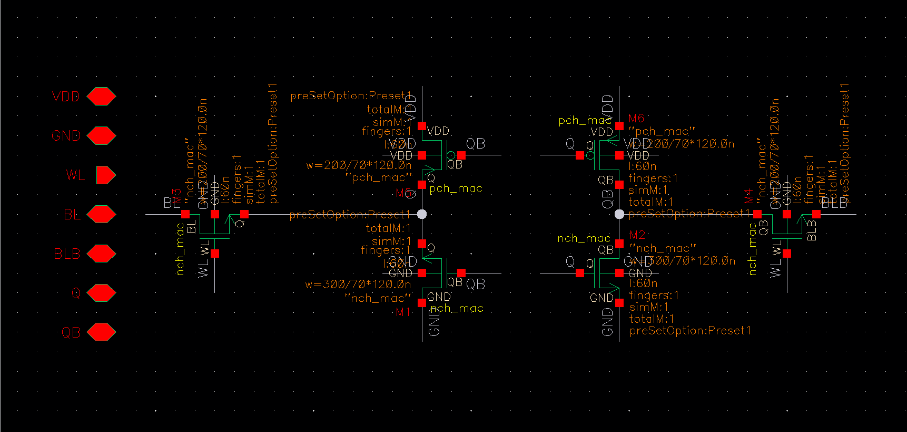
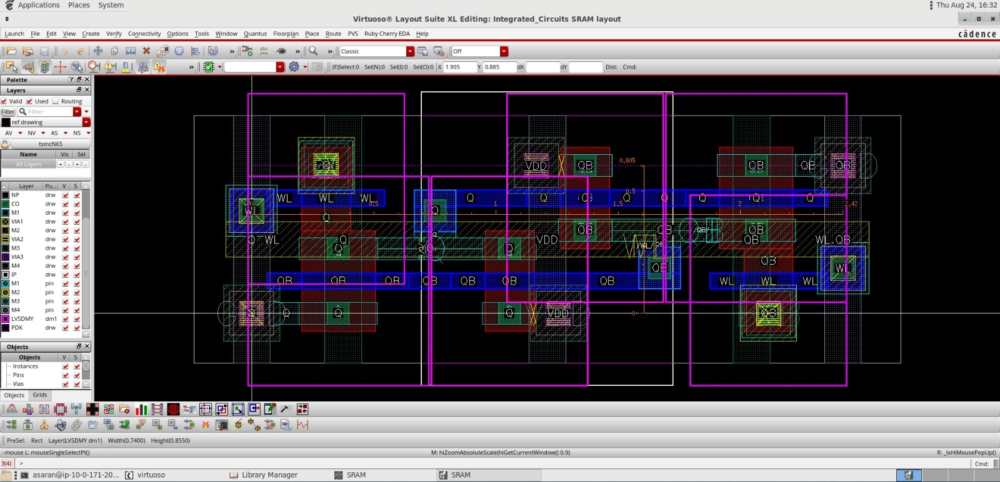
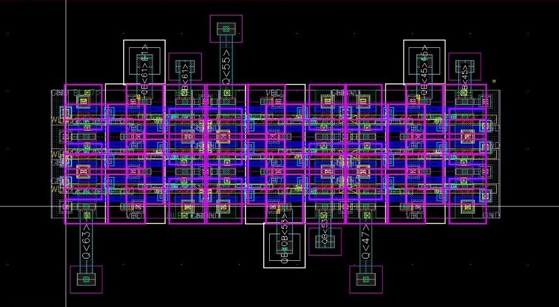

# Full-Custom 6T SRAM Layout Design (TSMC 65nm)

## Overview
This repository hosts the full-custom physical design and circuit implementation of a 6T SRAM memory block. Designed in TSMC 65nm CMOS technology, the project focuses on optimizing area efficiency, read/write stability (SNM), and clean layout topology using Cadence Virtuoso.

## Key Features
* **Technology Node:** TSMC 65nm CMOS.
* **Topology:** Standard 6-Transistor (6T) Bitcell.
* **Physical Design:** Full-custom layout with optimized aspect ratio and shared contacts.
* **Integration:** Scalable 8x8 Memory Array with continuous Wordline/Bitline routing.
* **Verification:** DRC (Design Rule Check) and LVS (Layout vs Schematic) Clean.

## 1. Single Bitcell Implementation
The fundamental memory element was designed for high stability margins.
* **Schematic:** Transistor sizing optimized for Pull-Up/Pull-Down ratios.
* **Layout:** Compact topology using standard cell design techniques.

### Schematic View

*Figure 1: Transistor-level schematic showing the 6T topology and sizing.*

### Layout View

*Figure 2: High-density bitcell layout showing diffusion, poly, and metal layers.*

## 2. 8x8 SRAM Array Architecture
To demonstrate scalability and abutment, the bitcell was arrayed into a memory block.
* **Routing:** Continuous metal routing for VDD/GND rails and signal lines.
* **Abutment:** Seamless connection between adjacent cells without DRC violations.

*Figure 3: Full 8x8 Array assembly demonstrating modular integration.*

## Tools Used
* **Layout & Schematic:** Cadence Virtuoso XL
* **Simulation:** Spectre
* **Physical Verification:** Mentor Graphics Calibre (DRC/LVS)
